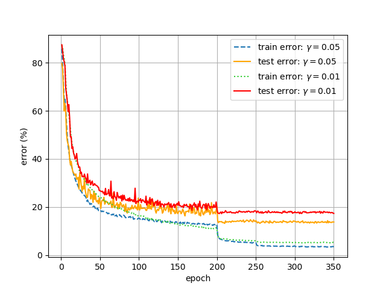

# CS4240
This project was part of the TU Delft Deep Learning course (CS4240). 
The goal of this project was to replicate or reproduce a result from a deep learning paper.
In this project the pytorch framework is used.
https://github.com/hans321/CS4240

Contributors to this project:

* Hans den Boer
* Jan van Tuijn
* Sybold Hijlkema

## Paper
The [paper][[1]] "Striving For Simplicity: The All Convolutional Net" (2014) is one of the top performing convolutional neural networks for object recognition on the CIFAR-10 dataset.
Most CNNs for object recognition are built using the same principles: Alternating convolution and max-pooling layers
followed by a small number of fully connected layers.[[1]] In this paper it is evaluated whether max-pooling can simply replaced by a convolutional layer with increased stride. 

We attempt to reproduce the results that are stated in the first experement (Table 3 from paper). For this experiment 12 models are trained. These models are derived from 3 base models, called Model A, Model B and Model C. For each base model, three additional models are derived: 

* (Strided-CNN-A/B/C) model in which max-pooling is removed and the stride of the convolutional layer preceding the max-pool layer is increased by 1.
* (All-CNN-A/B/C) model with max-pooling layer replaced by a convolutional layer.
* (ConvPool-CNN-A/B/C) model where an additional dense convolutional layer is placed before max-pooling layer.

| Model               | Error (%) | # parameters   | 
|---------------------|-----------|----------------|
| Model A             | 12.47%    | ≈ 0.9 M        | 
| Strided-CNN-A       | 13.46%    | ≈ 0.9 M        | 
| ConvPool-CNN-A      | 10.21%    | ≈ 1.28 M       | 
| ALL-CNN-A           | 10.30%    | ≈ 1.28 M       |
| Model B             | 10.20%    | ≈ 1 M          |
| Strided-CNN-B       | 10.98%    | ≈ 1 M          |
| ConvPool-CNN-B      | 9.33%     | ≈ 1.35 M       |
| ALL-CNN-B           | 9.10%     | ≈ 1.35 M       |
| Model C             | 9.74%     | ≈ 1.3 M        |
| Strided-CNN-C       | 10.19%    | ≈ 1.3 M        |
| ConvPool-CNN-C      | 9.31%     | ≈ 1.4 M        |
| ALL-CNN-C           | 9.08%     | ≈ 1.4 M        |

*Table 3 from paper*

## Replication
The goal of the replication is to replicate the accuracy of the 12 models listed in Table 3 of the paper.

### Fixing the available code
For this project the code from [[2]] was our starting point. This code contains a number of discrepancies with the paper. Namely, related to hyperparameters and post-processing.

#### Hyperparameters
First we found that the learning rate was set to 0.0001 in the code. The paper states the following set of learning rates was used: 0.25, 0.1, 0.05, 0.01. Unfortunately, the paper doesn't mention which learning rates resulted in the best results for each model but 0.001 as listed in the code definetely isn't one of them. Secondly, the code didn't include any weight-decay while the paper clearly states a weight-decay constant of 0.001 was used. 

#### CIFAR-10 post-processing
The paper description of the post-processing is very clear, they used normalization and image whitening. However, the code only applies normalization with the addition of horizontally flipping and padding. For image whitening the paper refers to a different paper [[3]] which states the whitening technique used is Zero Component Analysis (ZCA). ZCA essentially makes edges more prominant by filtering out low-order correlations between pixels. ZCA does introduce an additional hyperparameter $\epsilon$ which we fixed to 0.01 in our models. The images below show the effect of ZCA:
*Original CIFAR-10 images*
*CIFAR-10 images processed with ZCA*

### Results

Replication results for all models is shown in the table below.

| Model / Learning rate | 0.25 | 0.1   | 0.05  | 0.01  |
|---------------------|------|-------|-------|-------|
| Model A             | x    | 88.05 | 16.74 | 16.17 |
| Strided-CNN-A       | x    | x     | x     | 17.58 |
| ConvPool-CNN-A      | x    | x     | x     | 12.17 |
| ALL-CNN-A           | x    | x     | x     | x     |
| Model B             | x    | x     | x     | 14.06 |
| Strided-CNN-B       | x    | x     | x     | x     |
| ConvPool-CNN-B      | x    | x     | x     | x     |
| ALL-CNN-B           | x    | x     | x     | x     |
| Model C             | x    | x     | x     | 13.28 |
| Strided-CNN-C       | x    | x     | x     | x     |
| ConvPool-CNN-C      | x    | x     | x     | x     |
| ALL-CNN-C           | x    | x     | x     | x     |

The table entries indicate the model error (100 - accuracy).
Entries with an "x" indicate that no useful result could be obtained. We determined that the model was not useful if it was stuck at 90% error for atleast the first 10 epochs while training. This is because from several experimental observations it was observed that a model would never recover after getting stuck at 90% error irrespective of the learning rate.

The following figure illustrates how the train and test error change as function of the amount of epochs. 

## Extension

For our extension of the replication we focussed on two aspects: weight initialization and hyperparameter tunning

### Weight initialization
Since most of the replication results are stuck at 90% error,a different weight initialization algorithm is investigated. 
In the paper[[1]] weight initialization is not mentioned. The starting code [[2]] uses the default pytorch weight initialzation for convolutional layers, which is Kaiming He. However, in pytorch this default Kaiming He specifies leaky ReLU instead of ReLU as activation function. While in the paper the use of ReLU activation is mentioned. Another interesting aspect to mention is that the paper publishing Kaiming He weight initialization is from 2015, and [[1]] is also from 2015. This makes it unlikely that [[1]] used Kaiming He weight initialization. The default weight initialization for the caffe framework, used in [[1]], is to fill all the weights with zero. This also results in 90% error for the All-CNN-C model in combination with all the learning rates. Finally, we tried Xavier weight initialization for the All-CNN-C model. Unfortunately, all learning rates restulted in 90% error, except for a learning rate of 0.01, which resulted in an error of 12.74%. This is still 3.66% higher than the results published in the paper.

### Results

| Model C ALL CNN    | 0.25  | 0.1   | 0.05  | 0.01  |
|--------------------|-------|-------|-------|-------|
| Xavier weight init | x     | x     | x     | 12.74% |

*Error(%) with Xavier weight initialization for ALL-CNN-C model*

## Hyper parameter tuning
Some discrepancy between the results of the extended version and the results from the paper[[1]] can still be observed. In an attempt to somehow reduce this gap we investigated the influence of two hyper parameters parameters: weight-decay and batch size.

For both hyper parameters model ALL-CNN-C was investigated because model C is more explicitly elaborated in the paper[[1]] and the ALL-CNN-C was shown to have the best performance of all other models. 

### Weight-decay
From the replication results it is clear that the test error is around 10% larger than the train error. Our Hypothesis is that adding regularization will decrease this gap and thus improve the test error. To increase the regularization we attempted to increased the weight-decay.

| Model C ALL CNN | 0.005 | 0.003 | 0.002 | 0.0015 |
|-----------------|-------|-------|-------|--------|
| learning rate = 0.01 | 24.79 | 16.62 | 14.32 | 13.03 |

Increasing the weight-decay did indeed decrease the gap between train and test and often closed it completely. There was however a large negative effect on the train error which caused the final result to still be worse.
The figure below uses a weight-decay of 0.005, eventually resulting in a gap of around 3% points in error between test and error but the test error is significantly larger (11% points) compared to using a weight-decay of 0.001. 

Also note that:
Increasing the weight-decay beyond 0.005 appeared to always result in useless models (stuck at 90% error). 
Increasing the learning rate to 0.05 (the next step in the range from the paper[[1]]) also resulted in useless models after increasing the weight decay.

Therefore it is assumed the current weight-decay of 0.001 should not be changed.

### Batch size
The batch-size hyper-parameter indicates how many training samples are used to update the weights. The paper does not specify the batch-size that was used in their results but the given given code used a 32 training samples per iteration. Since the code divded the CIFAR-10 data-set in 50.000 training samples and 10.000 test samples each epoch updates the weights approximately 1500 times. 

To investigate the behaviour of the batch-size on the All-CNN-C model we increased to batch-size from 32 to 256. In theory this should result in higher accuracies with higher learning rates since each batch contains more information that can be learned. In the figure below we can see the train and test errors for two different learning rates when a batch-size of 256 is used. We can now see that unlike before, when we only had a succesfull run with a learning rate of 0.01 we can succesfully run the model with a learning rate of 0.05. More importantly we can see that the performance of the model with 0.05 learning rate actually scores better thus mathing our expectations.

~

## Conclusion
There is still a significant discrepancy between the replicated results and those shown in the paper[[1]]. Several parameters are not mentioned in the paper like batch size and weight initialization. It is not sure if we had known these parameters we would obtain better results than the default ones we used now.

We noticed that in the paper[[1]] it is mentioned (in table 1) that a global averaging over 6 x 6 spatial dimensions is performed just before the softmax. After analyzing the models we think this should be a global averaging over 8 x 8 spatial dimensions because otherwise there is a mismatch in dimensional sizes. In the given code we also observed that the averaged array has a size of 8 x 8. This is probably an error in the paper[[1]].

Some remaining unclearity originates from the strided model.
For us it is unclear if the strided model uses dropout after the convolution layer wich has an increased stride. In the paper[[1]] it is mentioned that "We applied dropout to the input image as well as after each pooling layer (or after the layer replacing the pooling layer respectively)."[[1]] but this does not specify what happens to the dropout if the pooling layer is ommited entirely.

Our recommendation to authors is to publish their original code which was used to obtain the results to make sure that all hyperparameters (also those implicitly assumed) are known.

## References
[[1]] [STRIVING FOR SIMPLICITY: THE ALL CONVOLUTIONAL NET](https://arxiv.org/abs/1412.6806)

[[2]] https://github.com/StefOe/all-conv-pytorch

[[3]] [Maxout networks](https://arxiv.org/pdf/1302.4389.pdf)
 
[1]: https://arxiv.org/abs/1412.6806
[2]: https://github.com/StefOe/all-conv-pytorch
[3]: https://arxiv.org/pdf/1302.4389.pdf
